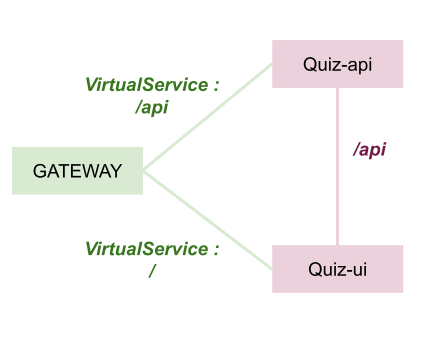
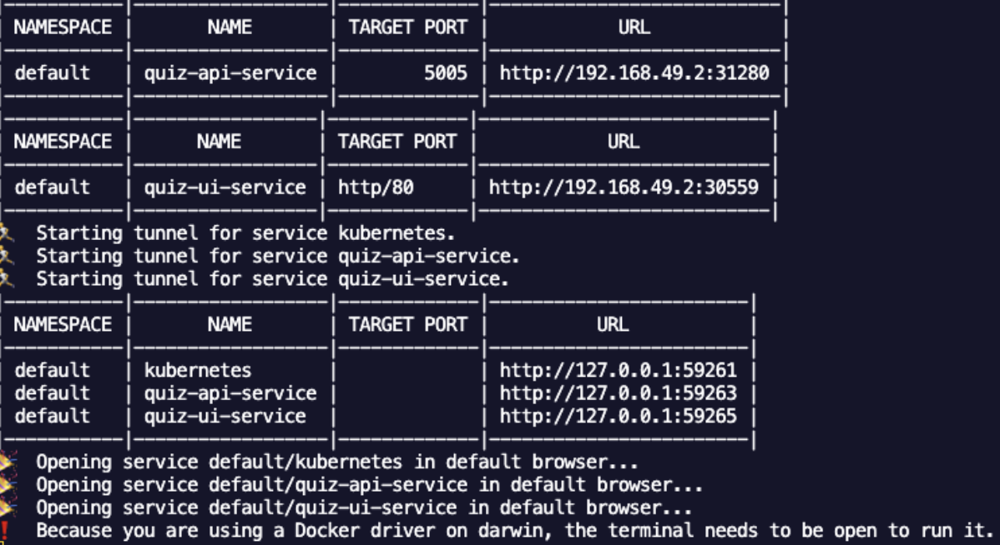
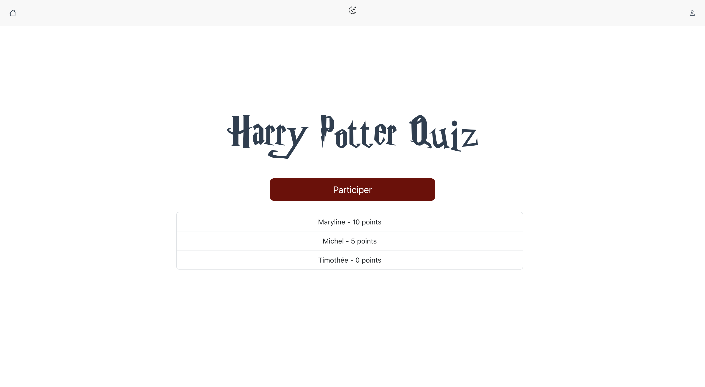
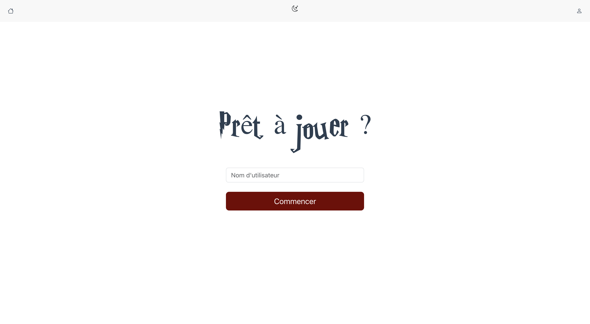
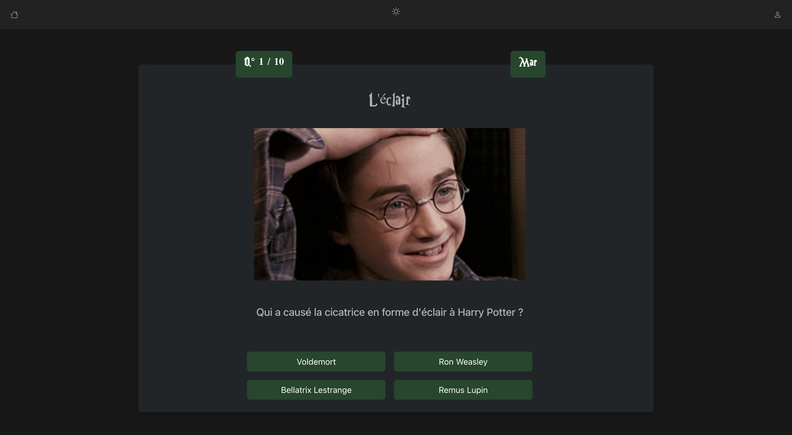

# Projet virtualisation

Réalisé par Yohan Astier et Maryline Fernandes

## Architecture du projet



## Travail réalisé

### Docker

#### Création des images

Les images docker se trouvent chacune dans le dossier respectif de leur projet :

- quiz-api : [Dockerfile](/quiz-api/Dockerfile)
- quiz-ui : [Dockerfile](/quiz-ui/Dockerfile)

#### Build des images

```
cd quiz-ui
docker build -t quiz-ui .

cd quiz-api
docker build -t quiz api .
```

#### Publication des images

```
docker tag [idImage] marfrnds/quiz-api:latest
docker push marfrnds/quiz-api:latest

docker tag [idImage] marfrnds/quiz-ui:latest
docker push marfrnds/quiz-ui:latest
```

### Création des service Kubernetes

#### Configuration Kubernetes

La configuration Kubernetes a été réalisée sur 3 fichiers différents :

- [quiz-ui.yml](/quiz-ui.yml) : créer le service et le déploiement de quiz-ui
- [quiz-api.yml](/quiz-api.yml) : créer le service et le déploiement de quiz-api
- [istio-config.yml](/istio-config.yml) : créer la gateway, le virtualservice quiz-api et le virtualservice quiz-ui

#### Déploiement

On peut déployer ces 3 configurations à l'aide du fichier suivant :

```
./deployment.sh
```

#### Test minikube

On teste les services avec :

```
minikube service --all
```



#### Lancement de la gateway ingress

On lance la gateway avec le script suivant :

```
./ingress-forward.sh
```

### Nettoyage du projet

Pour nettoyer tous les services et deploiements créer, lancer

```
./clean.sh
```

## Lancement rapide du projet

```
./deployment.sh
./ingress-froward.sh
```

## Résultats attendus

### Page d'accueil



### Page de début du jeu



### Jeu


